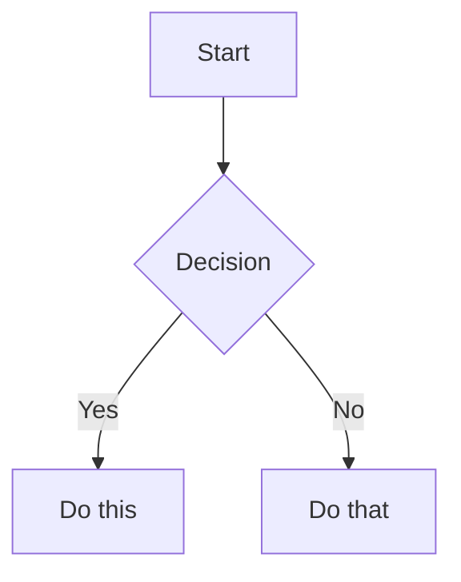

# Obsidian Skill

Complete Obsidian integration: vault operations + Obsidian-flavored markdown syntax.

---

## Part 1: Vault Configuration

> **⚠️ CONFIGURE YOUR VAULT PATH BELOW**
>
> Replace `{{OBSIDIAN_VAULT_PATH}}` with your actual Obsidian vault path.
> Common locations include iCloud Drive, `~/Documents/Obsidian/VaultName/`, Dropbox, or any local folder. Keep this as a user-provided path; do not hard-code another user's vault location.

### Vault Path

```
{{OBSIDIAN_VAULT_PATH}}
```

### Example Folder Structure

```
YourVault/
├── drafts/          # Message drafts, quick saves
├── inbox/           # Unsorted captures
├── projects/        # Project-specific folders
├── reference/       # Reference material
└── ...
```

---

## Part 2: Vault Operations

### Save a Note

```bash
# Save to drafts folder
cat > "{{OBSIDIAN_VAULT_PATH}}/drafts/filename.md" << 'EOF'
---
title: Note Title
date: 2026-04-28
tags:
  - draft
---

Content here...
EOF
```

### Read a Note

```bash
cat "{{OBSIDIAN_VAULT_PATH}}/path/to/note.md"
```

### List Notes in Folder

```bash
ls -la "{{OBSIDIAN_VAULT_PATH}}/drafts/"
```

### Search Notes

```bash
# Search by filename
find "{{OBSIDIAN_VAULT_PATH}}" -name "*.md" -name "*keyword*"

# Search content
grep -r "search term" "{{OBSIDIAN_VAULT_PATH}}" --include="*.md"
```

### Move/Rename Note

```bash
mv "{{OBSIDIAN_VAULT_PATH}}/old.md" "{{OBSIDIAN_VAULT_PATH}}/new.md"
```

---

## Part 3: Obsidian-Flavored Markdown

Obsidian extends CommonMark with wikilinks, embeds, callouts, properties, and comments.

### Properties (Frontmatter)

Always start notes with YAML frontmatter:

```yaml
---
title: My Note
date: 2026-04-28
tags:
  - project
  - active
aliases:
  - Alternative Name
status: in-progress
---
```

Default properties:
- `tags` — Searchable labels
- `aliases` — Alternative names for link suggestions
- `cssclasses` — CSS classes for styling

### Internal Links (Wikilinks)

```markdown
[[Note Name]]                          Link to note
[[Note Name|Display Text]]             Custom display text
[[Note Name#Heading]]                  Link to heading
[[Note Name#^block-id]]                Link to block
[[#Heading in same note]]              Same-note heading link
```

> Use `[[wikilinks]]` for vault notes (Obsidian tracks renames), `[text](url)` for external URLs only.

### Block References

Define a block ID by appending `^block-id` to any paragraph:

```markdown
This paragraph can be linked to. ^my-block-id
```

For lists and quotes, place block ID on separate line after:

```markdown
> A quote block

^quote-id
```

### Embeds

Prefix any wikilink with `!` to embed content inline:

```markdown
![[Note Name]]                         Embed full note
![[Note Name#Heading]]                 Embed section
![[image.png]]                         Embed image
![[image.png|300]]                     Image with width
![[document.pdf#page=3]]               Embed PDF page
```

### Callouts

```markdown
> [!note]
> Basic callout.

> [!warning] Custom Title
> Callout with custom title.

> [!tip]- Collapsed by default
> Foldable callout (- collapsed, + expanded).
```

Common types: `note`, `tip`, `warning`, `info`, `example`, `quote`, `bug`, `danger`, `success`, `failure`, `question`, `abstract`, `todo`

### Tags

```markdown
#tag                    Inline tag
#nested/tag             Nested tag hierarchy
```

Tags: letters, numbers (not first char), underscores, hyphens, forward slashes.

### Comments (Hidden in Reading View)

```markdown
This is visible %%but this is hidden%% text.

%%
This entire block is hidden.
%%
```

### Highlights

```markdown
==Highlighted text==
```

### Math (LaTeX)

```markdown
Inline: $e^{i\pi} + 1 = 0$

Block:
$$
\frac{a}{b} = c
$$
```

### Diagrams (Mermaid)

````markdown

````

### Footnotes

```markdown
Text with a footnote[^1].

[^1]: Footnote content.

Inline footnote.^[This is inline.]
```

---

## Part 4: Complete Example

````markdown
---
title: Project Alpha
date: 2026-04-28
tags:
  - project
  - active
status: in-progress
---

# Project Alpha

This project aims to [[improve workflow]] using modern techniques.

> [!important] Key Deadline
> The first milestone is due on ==January 30th==.

## Tasks

- [x] Initial planning
- [ ] Development phase
  - [ ] Backend implementation
  - [ ] Frontend design

## Notes

The algorithm uses $O(n \log n)$ sorting. See [[Algorithm Notes#Sorting]] for details.

![[Architecture Diagram.png|600]]

Reviewed in [[Meeting Notes 2024-01-10#Decisions]].
````

---

## Part 5: JSON Canvas (Optional)

For visual mind maps and flowcharts, create `.canvas` files:

```json
{
  "nodes": [
    {
      "id": "a1b2c3d4e5f67890",
      "type": "text",
      "x": 0,
      "y": 0,
      "width": 250,
      "height": 100,
      "text": "# Main Idea\n\nContent here"
    }
  ],
  "edges": []
}
```

Node types: `text`, `file`, `link`, `group`

Each node needs:
- Unique 16-char hex ID
- Position (`x`, `y`)
- Dimensions (`width`, `height`)

---

## Quick Reference

| Action | Command |
|--------|---------|
| Save draft | Write to `drafts/name.md` |
| Read note | `cat` the file path |
| Search | `grep -r "term" vault/` |
| List folder | `ls vault/folder/` |
| Link syntax | `[[Note]]` or `[[Note\|Display]]` |
| Embed | `![[Note]]` or `![[image.png]]` |
| Callout | `> [!type] Title` |
| Tag | `#tag` or `#nested/tag` |
| Highlight | `==text==` |
| Comment | `%%hidden%%` |

---

## References

- [Obsidian Help: Markdown](https://help.obsidian.md/obsidian-flavored-markdown)
- [Obsidian Help: Links](https://help.obsidian.md/links)
- [Obsidian Help: Embeds](https://help.obsidian.md/embeds)
- [Obsidian Help: Callouts](https://help.obsidian.md/callouts)
- [Obsidian Help: Properties](https://help.obsidian.md/properties)
- [JSON Canvas Spec](https://jsoncanvas.org/)
