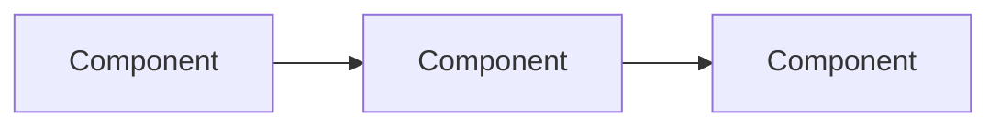
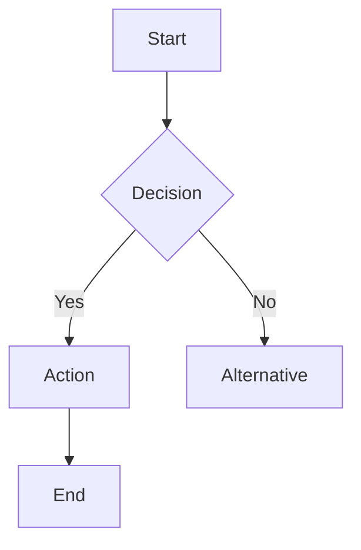

# Process Meeting Skill

Process voice transcripts or raw meeting notes from Apple Notes into structured meeting documentation.

## Trigger

User says: "process meeting [note name]" or "process the meeting from [note name]"

## Input

- Apple Notes note name (in any folder)
- Or raw text pasted directly

## Output

Structured meeting note saved to Obsidian vault:
`{{OBSIDIAN_VAULT_PATH}}/inbox/meetings/YYYY-MM-DD-meeting-name.md`

> **Configure your vault path:** Replace `{{OBSIDIAN_VAULT_PATH}}` with your Obsidian vault location.
> Example: `~/Documents/Obsidian/VaultName`

## Process

<process-meeting>

### Step 1: Read the source

If a note name is provided, read from Apple Notes:
```bash
osascript -e 'tell application "Notes" to get body of note "[note name]"'
```

If raw text is pasted, use that directly.

### Step 2: Analyze meeting length and type

Determine:
- **Length**: Short (<15 min), Medium (15-45 min), Long (>45 min)
- **Type**: Product/technical, Process/workflow, Planning, 1:1, Status update, External/partner

This affects output depth:
- Short meetings → concise notes (1-2 paragraphs summary, brief sections)
- Long meetings → detailed notes (full summary, comprehensive sections)

### Step 3: Extract and structure

Create the meeting note with these sections:

```markdown
# [Meeting Title]

**Date:** YYYY-MM-DD  
**Attendees:** [names if mentioned]  
**Type:** [Product | Process | Planning | 1:1 | Status | External]  
**Duration:** [Short | Medium | Long]

---

## Summary

[Proportional to meeting length. For short meetings: 2-3 sentences. For long meetings: 2-3 paragraphs covering key themes and outcomes.]

---

## Key Points

- [Important point 1]
- [Important point 2]
- [Important point 3]
[Number of points proportional to meeting length]

---

## Decisions Made

- [Decision 1]
- [Decision 2]
[If no explicit decisions, note "No formal decisions recorded"]

---

## Action Items

| Owner | Action | Due | Status |
|-------|--------|-----|--------|
| [Name] | [Specific action] | [Date or "TBD"] | Open |
| [Name] | [Specific action] | [Date or "ASAP"] | Open |

**Immediate follow-ups (within 24 hours):**
- [ ] [Action that needs to happen today/tomorrow]

---

## [Visual Diagram - if applicable]

### For Product/Technical meetings:

Create an architecture or system diagram using Mermaid:



### For Process/Workflow meetings:

Create a process flow diagram:



Include diagram ONLY if the meeting discussed:
- System architecture or components
- Process flows or workflows
- Integration patterns
- Decision trees or approval flows

---

## Raw Notes

<details>
<summary>Original transcript</summary>

[Paste the original unprocessed text here for reference]

</details>
```

### Step 4: Save the file

Save to: `{{OBSIDIAN_VAULT_PATH}}/inbox/meetings/YYYY-MM-DD-[slugified-title].md`

Example: `2026-04-19-agent-memory-architecture.md`

### Step 5: Report back

Tell the user:
- Where the file was saved
- Quick summary of what was captured (X action items, Y decisions, diagram included/not)
- Ask if they want to review or adjust anything

</process-meeting>

## Examples

**User:** "Process the meeting note called 'Platform sync'"

**Cal:** 
1. Reads note from Apple Notes
2. Identifies as Product/Technical meeting, Medium length
3. Creates structured note with architecture diagram
4. Saves to `{{OBSIDIAN_VAULT_PATH}}/inbox/meetings/2026-04-19-platform-sync.md`
5. Reports: "Processed meeting: 4 action items, 2 decisions, included memory architecture diagram. Saved to inbox/meetings."

**User:** "Process this meeting" [pastes raw text]

**Cal:** Same process, using pasted text as input.

## Notes

- Always preserve the raw transcript in a collapsed section
- When in doubt about ownership, mark as "TBD" and flag for user review
- Dates mentioned as "next week" or "Friday" should be converted to actual dates
- If attendees aren't clear, ask before processing or mark as "Unknown"
